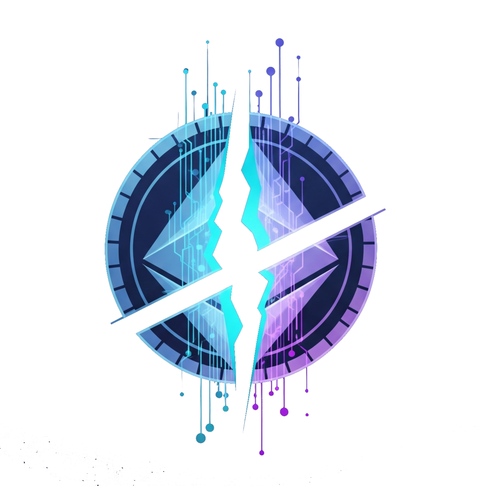

# 🌊 EtherRift - DeFi Learning Platform

<div align="center">
  
  <br/>
  <em>Master DeFi through interactive simulations and real blockchain interactions</em>
</div>

## 📖 About EtherRift

EtherRift is an innovative educational platform that bridges the gap between theoretical DeFi knowledge and practical blockchain experience. Built with React, Node.js, and Solidity smart contracts, it provides an immersive learning environment where users can explore various DeFi concepts through interactive simulations and real blockchain interactions.

## ✨ Key Features

### 🎓 **Educational Dimensions**
- **Stable Dimension**: Learn fundamental DeFi concepts like liquidity pools, staking, and lending
- **Volatile Dimension**: Master advanced topics including yield farming, impermanent loss, and derivatives
- **Arbitrage Dimension**: Explore sophisticated trading strategies and MEV opportunities

### 🎮 **Interactive Learning**
- **Step-by-step tutorials** with real-time feedback
- **Hands-on simulations** of DeFi operations
- **Achievement system** with blockchain-based tokens
- **Progress tracking** across all learning modules

### 💰 **DeFi Operations**
- **Token Swapping** with realistic market simulations
- **Liquidity Provision** with impermanent loss demonstrations
- **Yield Farming** with dynamic reward calculations
- **Flash Loans** for arbitrage strategies
- **DAO Governance** participation
- **Derivatives Trading** with leverage

### 🔗 **Blockchain Integration**
- **MetaMask wallet** integration
- **Smart contract** interactions
- **Real token balances** and transactions
- **Achievement token** minting
- **User registration** on blockchain

### 📊 **Advanced Features**
- **Real-time market data** simulation
- **Profit/loss calculations** with detailed feedback
- **Educational scripts** for each topic
- **Responsive design** for all devices
- **Dark theme** with cyberpunk aesthetics

## 🏗️ Architecture

```
EtherRift/
├── frontend/                 # React application
│   ├── src/
│   │   ├── components/      # UI components
│   │   ├── pages/          # Main application pages
│   │   ├── store/          # Redux state management
│   │   ├── contracts/      # Smart contract interactions
│   │   └── assets/         # Images and static files
├── backend-web2/            # Node.js/Express API
│   ├── src/
│   │   ├── controllers/    # API route handlers
│   │   ├── models/         # MongoDB schemas
│   │   └── routes/         # API endpoints
└── backend-web3/            # Solidity smart contracts
    ├── contracts/          # Smart contract source code
    └── scripts/            # Deployment scripts
```

## 🚀 Getting Started

### Prerequisites
- Node.js (v16 or higher)
- npm or yarn
- MetaMask browser extension
- MongoDB database
- Hardhat (for smart contract deployment)

### Installation

1. **Clone the repository**
   ```bash
   git clone <repository-url>
   cd EtherRift
   ```

2. **Install frontend dependencies**
   ```bash
   cd frontend
   npm install
   ```

3. **Install backend dependencies**
   ```bash
   cd ../backend-web2
   npm install
   ```

4. **Install smart contract dependencies**
   ```bash
   cd ../backend-web3
   npm install
   ```

### Configuration

1. **Set up environment variables**
   ```bash
   # backend-web2/.env
   MONGODB_URI=your_mongodb_connection_string
   PORT=3001
   
   # backend-web3/.env
   PRIVATE_KEY=your_private_key
   INFURA_URL=your_infura_url
   ```

2. **Deploy smart contracts**
   ```bash
   cd backend-web3
   npx hardhat compile
   npx hardhat deploy --network <your-network>
   ```

3. **Update contract addresses**
   Update the contract addresses in `frontend/src/contracts/contract.js` with your deployed contract addresses.

### Running the Application

1. **Start the backend server**
   ```bash
   cd backend-web2
   npm start
   ```

2. **Start the frontend application**
   ```bash
   cd frontend
   npm run dev
   ```

3. **Access the application**
   Open your browser and navigate to `http://localhost:5173`

## 🎯 Learning Path

### Stable Dimension
1. **What is DeFi?** - Introduction to decentralized finance
2. **Liquidity Pools & AMMs** - Understanding automated market makers
3. **Staking** - Earning rewards for network security
4. **Lending & Borrowing** - DeFi lending protocols
5. **Stablecoins** - The role of stable assets in DeFi

### Volatile Dimension
1. **Yield Farming** - Maximizing returns through complex strategies
2. **Impermanent Loss** - Understanding LP risks
3. **Leverage & Liquidation** - Advanced trading concepts
4. **DeFi Derivatives** - Options, futures, and synthetic assets
5. **DAO Governance** - Participating in protocol decisions

### Arbitrage Dimension
1. **Cross-Exchange Arbitrage** - Profiting from price differences
2. **Triangular Arbitrage** - Three-trade arbitrage strategies
3. **Flash Loans** - Capital-efficient arbitrage
4. **Cyclical Arbitrage** - Multi-asset trading cycles

## 🏆 Achievement System

- **Milestone Topics**: Complete advanced topics to earn Achievement Tokens (ERA)
- **Progress Tracking**: Monitor your learning journey across all dimensions
- **Blockchain Verification**: Achievements are recorded on the blockchain
- **Token Rewards**: Earn ERA tokens for completing milestone topics

## 🔧 Technical Stack

### Frontend
- **React 18** with Vite for fast development
- **Redux Toolkit** for state management
- **Tailwind CSS** for styling
- **Framer Motion** for animations
- **Ethers.js** for blockchain interactions

### Backend
- **Node.js** with Express.js
- **MongoDB** for user data storage
- **Mongoose** for database modeling
- **CORS** enabled for cross-origin requests

### Smart Contracts
- **Solidity** for smart contract development
- **Hardhat** for development environment
- **OpenZeppelin** for secure contract libraries
- **EtherRiftCore**: Main contract for user management
- **TradingFunctions**: DeFi operations contract
- **AchievementToken**: ERC20 token for achievements

## 🎨 Design Features

- **Cyberpunk Aesthetic**: Dark theme with neon accents
- **Responsive Design**: Works on desktop, tablet, and mobile
- **Smooth Animations**: Engaging user interactions
- **Glassmorphism Effects**: Modern UI design elements
- **Custom Fonts**: Orbitron font for futuristic feel

## 🔐 Security Features

- **MetaMask Integration**: Secure wallet connection
- **Smart Contract Security**: Audited contract patterns
- **Input Validation**: Client and server-side validation
- **Error Handling**: Comprehensive error management
- **Rate Limiting**: API protection against abuse

## 📈 Performance Optimizations

- **Code Splitting**: Lazy loading of components
- **Image Optimization**: Compressed assets
- **Caching**: Redux state persistence
- **Bundle Optimization**: Tree shaking and minification
- **CDN Ready**: Static asset optimization

## 🤝 Contributing

We welcome contributions! Please read our contributing guidelines and submit pull requests for any improvements.

### Development Guidelines
- Follow the existing code style
- Add comprehensive tests for new features
- Update documentation for API changes
- Ensure all tests pass before submitting

## 📄 License

This project is licensed under the MIT License - see the [LICENSE](LICENSE) file for details.

## 🙏 Acknowledgments

- **OpenZeppelin** for secure smart contract libraries
- **Ethers.js** for Ethereum interactions
- **Tailwind CSS** for the styling framework
- **Framer Motion** for animations
- **React Router** for navigation

## 📞 Support

If you encounter any issues or have questions:
- Create an issue in the GitHub repository
- Check the documentation in the `/docs` folder
- Join our community discussions

---

<div align="center">
  <strong>Built with ❤️ for the DeFi community</strong>
  <br/>
  <em>Empowering the next generation of DeFi users</em>
</div> 